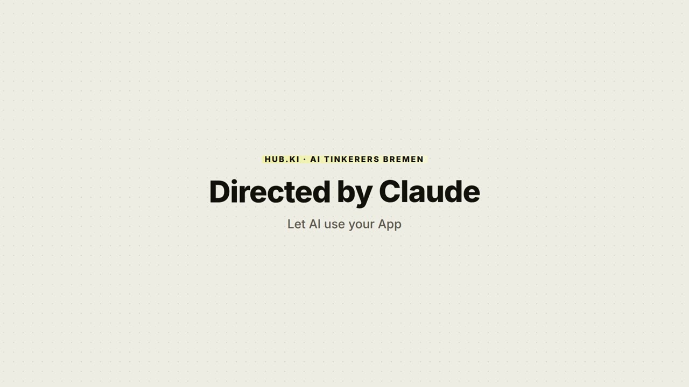

<div align="center">

# video-generation

**Turn an app — or a public website — into a finished, designed video.**
Concept first, then the footage, in the brand you give it.

[](LICENSE)


<br>

<a href="https://youtu.be/sVfOqokOW98"></a>

**▶ [Directed by Claude](https://youtu.be/sVfOqokOW98)** — five minutes on how this works, shot with the skills in this repo.

<sub>The look is HUB.KI&#39;s own house style. What ships in the box is neutral black and white,<br>and takes the brand you give it.</sub>

</div>

> **Open-sourced by HUB.KI.** Built and used in production at [HUB.KI](https://hub.ki), released
> independently under the MIT License. Still maintained there.

---

A screen recording is not a demo video. The difference is everything around the footage: what the
video is *for*, which four things it shows, where the viewer's eye goes in each shot, and whether
the words were agreed before anyone pressed record.

Two agent skills do that work. You describe the video; an agent writes the concept, gets your
approval on the words, records the app itself, composes a designed cut, narrates it, verifies the
result against the source pixels, and renders 4K.

```
video-plan   →  PLAN.md + SCRIPT.md          the two documents a video is approved on
demo-video   →  renders/<name>_4k.mp4        capture · compose · narrate · verify · render
```

They are separate because they fail differently. A plan can be right while the copy is wrong, and
a video shot against an unagreed arc gets re-shot. So the words get approved by a human who never
runs the pipeline — and only then does footage exist.

## Install

```bash
git clone https://github.com/hub-ki/video-generation.git ~/code/video-generation
```

Then link the two skills into whatever your agent reads:

| Runtime | Skills directory | Status |
| --- | --- | --- |
| [Claude Code](https://claude.com/claude-code) | `~/.claude/skills/` | tested |
| Other `SKILL.md` loaders | runtime-specific | expected to work, untested |

```bash
ln -s ~/code/video-generation/skills/video-plan  ~/.claude/skills/video-plan
ln -s ~/code/video-generation/skills/demo-video  ~/.claude/skills/demo-video
```

Symlinking rather than copying means `git pull` keeps them current. The render toolchain
bootstraps itself on first use into `~/.hyperframes-cli` and `~/.hyperframes-ffmpeg` — a pinned
[HyperFrames](https://www.npmjs.com/package/hyperframes) CLI and a usable ffmpeg. It touches
nothing outside those two directories.

## Two-minute try

No login, no API key, nothing written outside the project:

```
> Create a silent 1080p site tour of https://example.com. This is a smoke test.
```

Say "smoke test" and the skill skips the approval rounds, the brand and the narration, and hands
back a short 1080p cut. It will not assume that on its own — a request for a video is a request
for a video, and the arc, the words and the brand are exactly the parts that cannot be added to a
finished draft afterwards.

## The full run

```
> Make a guide video showing how tool permissions work in https://app.example.com.
> Cover finding the setting, the three levels, and the per-tool override.
> Use the brand from https://example.com.
```

The agent asks what the video is for and whether to analyse the app first, agrees the arc, writes
`PLAN.md` and `SCRIPT.md`, and **stops for your approval**. Then it confirms the shot list, signs
you in once, records, composes, and hands back a 1080p cut to react to — then a 4K master when you
say you are happy.

## What it is for

**Good for:** product demos, feature walkthroughs, how-to guides, onboarding clips, site tours —
a video shown inside a product or to a specific customer, whose viewer already knows what they are
looking at.

**Not for:** an ad aimed at a cold audience. That is a differently *captured* video, so it cannot
be fixed in the edit. Both skills say so and stop rather than approximating one.

**Targets:** your own web app, including behind a login you control, and public third-party pages.
Not pages behind bot protection; targets inside shadow DOM or an inner scroll container need their
selectors handed over rather than found by text. Authenticated third-party sites are possible and
discouraged — see [`references/foreign-sites.md`](skills/demo-video/references/foreign-sites.md) §0.

## Filming sites you do not own

The short version, because it is the part with consequences:

- **It clicks only consent controls that identify themselves** — a vendor container, a vendor
  frame, or a selector you supply. Anything else consent-shaped is reported and deliberately not
  pressed, and the capture stops with a screenshot. Geometry and wording cannot tell a cookie
  banner from an invitation or a change-of-terms dialog.
- **A clean result means "this rig found nothing", not "there is no wall."** On a target that
  matters, look at the first frame yourself.
- **Filming is read-only in intent**: no forms, no accounts, no writes. It does click consent
  buttons, hide overlays and tag the element it is about to film — client-side, in a throwaway
  profile, and worth knowing.
- **Public pages by default.** No embedded credentials, no localhost or private address ranges.

Full rules, and the questions that belong in the plan rather than in your head:
[`references/foreign-sites.md`](skills/demo-video/references/foreign-sites.md).

## Tests

```bash
npm install     # installs playwright and its chromium build
npm test
```

Frontmatter validation first — a `SKILL.md` description over the loader's 1024-character limit is
rejected outright, the skill never starts, and nothing says so; both skills shipped that way once.
Then 56 deterministic `file://` fixtures, no network. Every fixture is a defect that actually
happened, including the negative cases: a sticky header offering "Accept invitation", a responsive
embed, an application delivered as a full-viewport iframe.

Run it after touching `skills/demo-video/scripts/capture-lib.js`. Live smoke runs against real
websites are worth doing and are not a substitute — they cannot tell you that yesterday's
behaviour still holds.

## Repo layout

```
skills/
├── video-plan/             the concept skill — PLAN.md and SCRIPT.md
│   └── references/         guide format · site tours · copy rules · spoken track ·
│                           the application concept a plan projects from
└── demo-video/             the production skill
    ├── README.md           how to drive it, and the project files it creates
    ├── SKILL.md            the agent instructions
    ├── assets/             composition template · brand example · test fixtures
    ├── examples/starter/   PLAN.md · SCRIPT.md · narration.mjs to copy
    ├── references/         brand · design system · capture · foreign sites · containers ·
    │                       ffmpeg · pitfalls · voiceover · timeline
    └── scripts/            setup · brand · capture rig · audit · verification · audio · tests
```

The references read as incident reports rather than as a manual. Each rule is there because a
prose rule alone did not stop something happening twice, and wherever possible it became a script
that exits 1.

## Contributing

Issues and pull requests are welcome from anyone. Two things make a change easy to accept:

- **Run `npm test`** and add a fixture for whatever you fixed.
- **Say what went wrong**, not just what you changed. Most of this repository's value is in the
  paragraphs explaining why a rule exists; a fix without that explanation tends to get re-broken by
  the next person who finds the rule inconvenient.

## Who maintains it

Built at **[HUB.KI](https://hub.ki)** to make its own product videos, used there in production,
and released under MIT because the pipeline turned out to be useful without the platform around
it. Still maintained by the same people.

## Licence

MIT — see [LICENSE](LICENSE).
